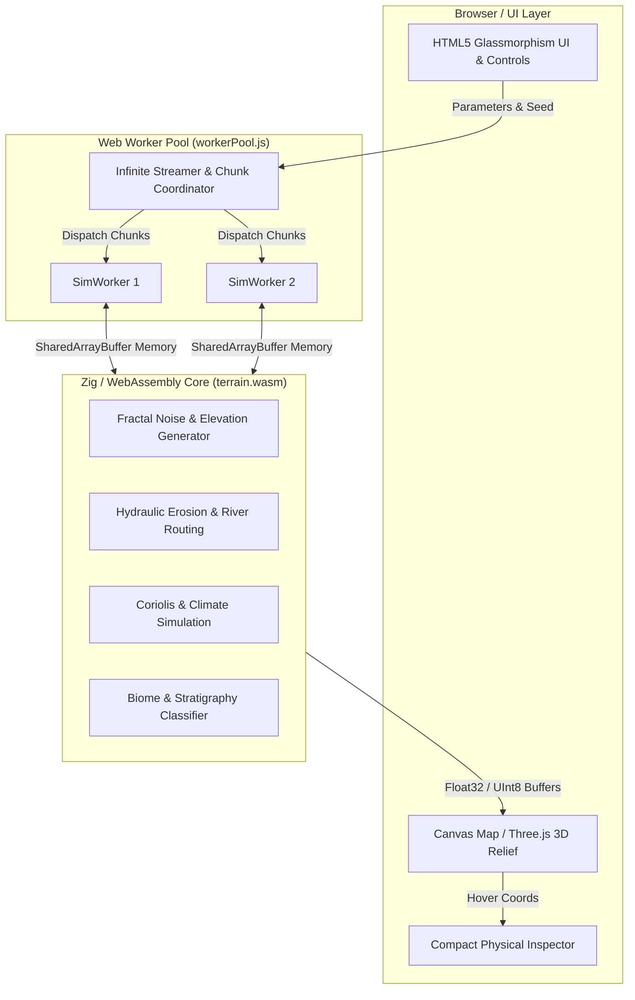

# HYANG - Infinite Procedural World Engine & Planetary Simulation

<div align="center">

[](https://hyang.pages.dev)
[](https://opensource.org/licenses/MIT)
[](https://ziglang.org/)
[](https://webassembly.org/)
[](https://threejs.org/)
[](https://nodejs.org/)

**A standalone, high-performance physical world simulation featuring hydraulic erosion, tectonic geodynamics, Coriolis atmospheric circulation, and geological stratigraphy - powered by Zig & WebAssembly.**

---


</div>

> **🌐 Try the Live Simulation Online**  
> Experience the real-time planetary world engine directly in your browser without any installation: **[https://hyang.pages.dev](https://hyang.pages.dev)**

---

## Overview

**HYANG** is an advanced procedural planetary simulation engine designed to bridge the gap between real-time web graphics and rigorous geophysical modeling. Unlike simple noise-based heightmap generators, HYANG simulates interconnected Earth systems: stellar radiation, atmospheric lapse rates, tectonic plate movement, mantle heat decay, hydrological routing, and chemical geochemistry.

By compiling high-performance algorithms written in **Zig** directly to **WebAssembly (WASM)**, HYANG achieves near-native execution speeds in the browser. It leverages **Web Workers** and **SharedArrayBuffer** for non-blocking, infinite terrain streaming and real-time 3D relief displacement via **WebGPU/WebGL** and **Three.js**.

---

## Key Features

- **Near-Native WASM Computation**: Core algorithms (including multi-octave fractal generation, hydraulic erosion routing, and atmospheric thermal solvers) are implemented in clean, zero-allocation **Zig** compiled to WebAssembly.
- **Planet Physics Lab & Archetypes**: Live-tune astronomical and planetary parameters in real time. Experiment with custom mass, water fraction, axial tilt, star luminosity, and radioactive mantle heat, or load curated celestial archetypes:
  - 🌍 **Earth-like (Water World)** - Balanced ocean basins and active plate tectonics.
  - 🏜️ **Desert World (Arid Dunes)** - Low moisture retention with vast continental wind patterns.
  - 🌊 **Ocean World (Deep Pelagic)** - High water fraction with submerged volcanic ridges.
  - 🪨 **Super-Earth (High Gravity)** - Denser atmospheres, compressed lapse rates, and strong surface gravity.
  - ❄️ **Ice Giant (Extreme Tilt)** - Extreme seasonal insolation and cryo-geology.
  - 🌋 **Volcanic World** - High radioactive mantle vigour ($H_0$) and intense tectonic activity.
- **7 Multi-Layered Map Modes**:
  - **Elevation**: Real-time 3D displacement and terrain relief.
  - **Biomes**: Dynamic ecosystem classification based on Whittaker’s temperature/moisture matrix.
  - **Geology (Stratigraphy)**: Isostatic crust balance and geochemical rock layer deposition.
  - **Hydrology**: Flow direction accumulation, river network routing, and erosion carving.
  - **Climate**: Temperature fields adjusted for elevation lapse rates and solar insolation.
  - **Humidity**: Moisture evaporation, Coriolis wind transport, and rain shadows.
  - **Tectonics**: Continental drift vectors, crustal boundaries, and mantle heat dynamics.
- **Infinite Procedural Streaming**: Navigate an endless planetary surface with background chunk generation, automated origin recentering, and multi-threaded worker pools.
- **Interactive HUD Inspector**: Inspect real-time coordinates, altitude, elevation type, temperature, humidity, river flow rate, geology, and biome classification at any point on the map.

---

## Scientific & Mathematical Basis

HYANG's physical simulation models are built upon foundational geophysical literature (*Turcotte & Schubert*, *Foley & Driscoll*, *Korenaga 2013*, *Oosterloo et al. 2021*):

1. **Surface Gravity & Atmospheric Retention**:
   
   Gravity (g) = (G × Mₚ) / Rₚ²
   
   Escape Velocity (v_esc) = √(2G × Mₚ / Rₚ)
   
   Atmospheric surface pressure scales dynamically with escape velocity and mass retention.

2. **Stellar Insolation & Energy Balance**:
   
   Solar Constant (S₀) = L⋆ / (4πa²)
   
   T_eq = [S₀(1 - A) / 4σ]^(1/4)

   Surface temperature incorporates greenhouse gas scaling and dry adiabatic lapse rates (Γ = g / Cₚ).

3. **Hydraulic Erosion & Hydrology**:
   Simulates droplet routing across discrete grid cells, calculating sediment carrying capacity, deposition, and erosion carving based on slope velocity and water volume.

4. **Geodynamics & Isostasy**:
   Models crustal buoyancy (Airy isostasy) where continental and oceanic crust float upon a denser viscous mantle governed by radioactive decay heat (H₀).

---

## 🏗️ Architecture & Data Flow



---

## 🚀 Getting Started

### Online Access
The easiest way to experience **HYANG** is via the live web deployment. No local installation or compilation is required:  
👉 **[https://hyang.pages.dev](https://hyang.pages.dev)**

---

### 💻 Local Setup & Prerequisites

- **Node.js** (v16.x or higher recommended)
- **Modern Web Browser** with support for **WebAssembly**, **WebGL/WebGPU**, and **SharedArrayBuffer**.
- *(Optional)* **Zig 0.13.0** if you wish to modify and recompile the WebAssembly engine.

### Quick Start

1. **Clone the repository**:
   ```bash
   git clone https://github.com/MzIbang/Hyang.git
   cd Hyang
   ```

2. **Start the local server**:
   ```bash
   npm start
   # or run directly with Node:
   node server.js
   ```

3. **Open in your browser**:
   Navigate to [http://localhost:3005](http://localhost:3005).

> [!IMPORTANT]
> **Why is a custom HTTP server required?**  
> To achieve high-performance multi-threaded simulation without data copying, HYANG uses `SharedArrayBuffer`. For security reasons, web browsers require strict isolation headers to enable this feature. The included `server.js` automatically configures the necessary **COOP** (`Cross-Origin-Opener-Policy: same-origin`) and **COEP** (`Cross-Origin-Embedder-Policy: require-corp`) headers.

---

## 🔨 Compiling Zig to WebAssembly

If you make modifications to `./terrain.zig`, you can recompile the WebAssembly binary using the included Windows build script or manually via the Zig CLI.

### Using Windows Script
```cmd
build.bat
```

### Manual Compilation (Zig 0.13.0)
```bash
zig build-exe terrain.zig \
    -target wasm32-freestanding \
    -O ReleaseFast \
    -fno-entry \
    -femit-bin=terrain.wasm \
    --export=getElevationPtr \
    --export=getRiverFlowPtr \
    --export=getFlowDirectionPtr \
    --export=getMoisturePtr \
    --export=getTemperaturePtr \
    --export=getStratigraphyPtr \
    --export=getBiomeIdsPtr \
    --export=setWorldType \
    --export=setChunkOffset \
    --export=setPlanetParams \
    --export=initRand \
    --export=initNoise \
    --export=generateFractalTerrain \
    --export=runHydraulicErosion \
    --export=generateRivers \
    --export=runAtmosphericSimulation \
    --export=assignBiomesNoise
```


> The compiled binary is emitted to `./terrain.wasm` and is immediately ready to be loaded by `renderer.js` and `simWorker.js`.

---

## 📸 Map Modes Gallery (Placeholders)

<div align="center">
  <table>
    <tr>
      <td align="center">
        <br />
        <b>Elevation & 3D Relief</b>
      </td>
      <td align="center">
        <br />
        <b>Biomes & Ecosystems</b>
      </td>
    </tr>
    <tr>
      <td align="center">
        <br />
        <b>Hydrology & River Networks</b>
      </td>
      <td align="center">
        <br />
        <b>Tectonic Plate Boundaries</b>
      </td>
    </tr>
  </table>
</div>

---

## 📜 License & Credits

- **Author**: Created by **MzIbang**.
- **License**: Distributed under the [MIT License](https://opensource.org/licenses/MIT). See `LICENSE` for more information.

---

<div align="center">
  <p>Built with ❤️ by Ibang using <b>Zig</b>, <b>WebAssembly</b>, and <b>JavaScript</b>.</p>
</div>